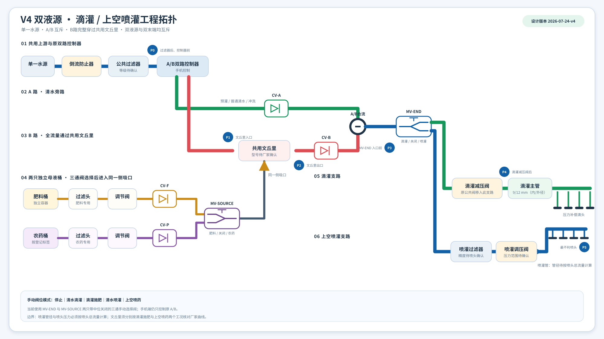
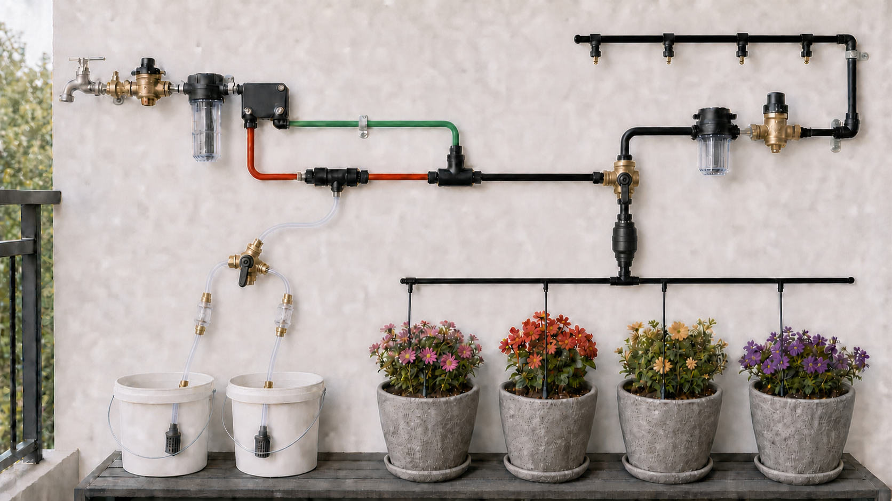

---
hide:
  - toc
---

# V4 双液源水肥药一体化系统

> 文档类型：入口索引  
> 最后核对日期：2026-07-24  
> 事实来源：本仓库设计约束、现场待测参数及所购设备厂家数据表

本网站记录单一水源下的双液源、双末端改造。原手机双路控制器继续负责 A/B；A 路输送清水，B 路全部水流通过共用文丘里。当前先用 `MV-END`、`MV-SOURCE` 两只带中位全关的三通手动选择阀验证液源和末端切换，水力验收后再接入电控。

图 1：系统工程拓扑。连接关系、流向、测点和流量标记以本图为设计基准；点击图片可查看全尺寸版本。

  

    <strong>已确定设计</strong>
    A/B 互斥、B 路串联共用文丘里、双桶独立、先合流再分滴灌/喷灌。
  

  

    <strong>待现场实测</strong>
    P0～P5、两末端流量、两桶吸液量、喷灌均匀性和清水置换终点。
  

  

    <strong>待厂家确认</strong>
    手动阀、喷头、两套调压、喷灌管径、文丘里双工况曲线和材料兼容性；后续电控型号另行确认。
  

!!! warning "先判断水力可行性"
    `A → B → A` 既可用于滴灌施肥，也可用于上空喷药，但两个工况必须分别核对流量、P1/P2 和厂家曲线。喷药剂量与施用方法必须来自登记标签，系统不自行改变。

## 当前设计数据

--8<-- "docs/_generated/current-design-summary.md"

## 按任务阅读

| 要完成的任务 | 先读 | 再核对 |
| --- | --- | --- |
| 按图识别水路和测点 | [工程图读图与测点](architecture/diagram-walkthrough.md) | [系统原理](architecture/system-overview.md) |
| 购买部件 | [部件选型与数量计算](design/component-sizing.md) | [资料来源与厂家数据](reference/sources.md) |
| 核对牙型和转接件 | [接口、牙型与管径清单](reference/interface-schedule.md) | 接口规格事实簿 |
| 判断压力和文丘里 | [工程计算工作表](calculations/engineering-calculator.md) | 所购型号曲线与现场实测表 |
| 安装并首次通水 | [安装与清水调试](operations/installation-commissioning.md) | [故障诊断](operations/troubleshooting.md) |
| 设置运行模式 | [A/B 程序与手动阀位](operations/controller-program.md) | 控制器本地计划和两只三通阀位置 |
| 维护程序和生成文件 | [程序路径与生成流程](reference/program-structure.md) | `package.json` 中的同步、测试和构建命令 |

## 图片说明

图 2：无品牌实景参考。两只三通手动选择阀、塑料止回/调压件和单端喷灌进水用于表达空间关系；端口与流向仍以工程拓扑为准。

## 使用原则

1. 两只母液桶均先装清水，分别完成压力、反向窜流、滴灌/喷灌流量和文丘里吸液试验。
2. 只有清水试验通过后才加入肥料；农药还必须核对登记标签。
3. 任何缺少厂家曲线或动态压力的关键项都标记为“待确认”，不能用接口口径代替性能数据。
4. 滴灌以末端水质恢复为冲洗终点；喷药按共用段和喷灌管内容积安排清水置换，并计入标签允许的总载水量。
