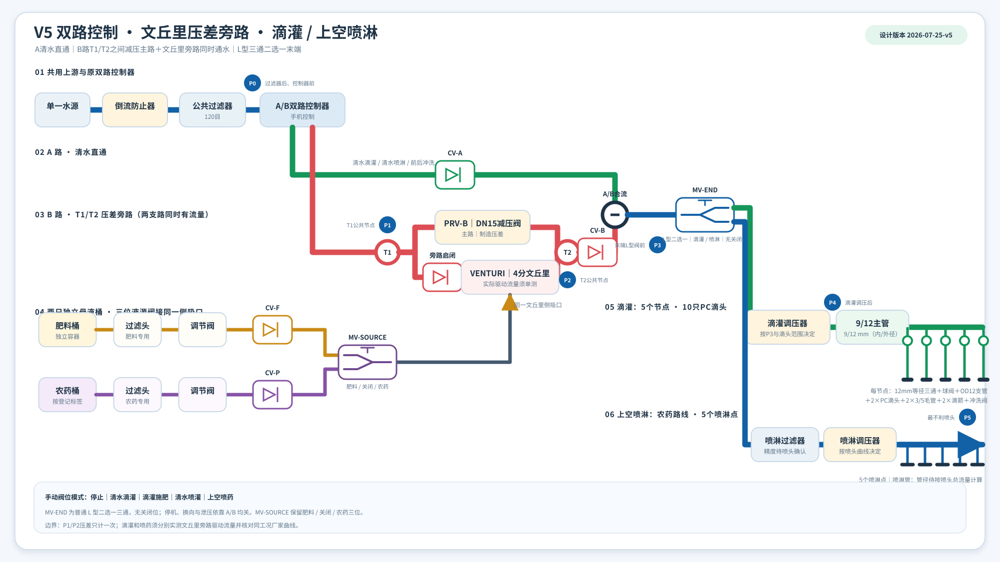
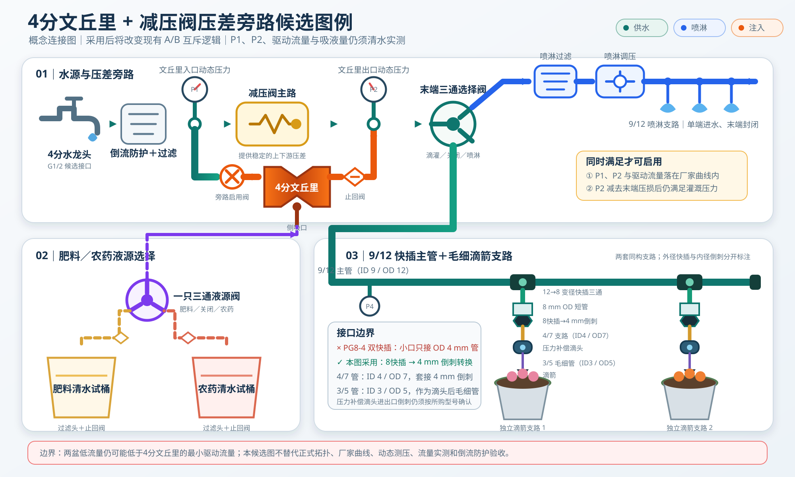

---
hide:
  - toc
---

# V5 双液源压差旁路水肥药系统

> 文档类型：入口索引  
> 最后核对日期：2026-07-25
> 正式设计版本：`2026-07-25-v5`

本网站记录单一水源下的清水、滴灌施肥和上空喷药系统。原太阳能 4G 双路控制器继续只负责 A/B：A 路清水直通，B 路在 T1/T2 之间由“减压阀主路＋文丘里旁路”并联组成，两路在 B 路运行时同时通水。A/B 合流后，一只普通 L 型三通球阀在滴灌和喷淋之间二选一；停止依靠 A/B 均关，末端阀没有关闭位。

<a class="diagram-zoom" href="assets/generated/fertigation-system-topology-v5.svg" title="打开全尺寸 v5 工程拓扑图">
  
</a>

<p class="figure-note">图 1：2026-07-25-v5 正式工程拓扑。点击图片可查看全尺寸版本；旧 v4 图仅用于版本追溯。</p>

<div class="status-grid">
  <div class="status-card">
    <strong>已确定设计</strong>
    A/B 互斥、T1/T2 压差旁路、L 型末端二选一、5 个滴灌节点、10 只 PC 滴头和 5 个喷淋点。
  </div>
  <div class="status-card">
    <strong>待现场实测</strong>
    P0～P5、两种 B 路工况的实际文丘里驱动流量与吸液量、管长、滴头/喷头流量和均匀性。
  </div>
  <div class="status-card">
    <strong>待厂家确认</strong>
    文丘里曲线、调压器、喷头、喷淋管径、螺纹转接件、低流量压损及介质材料兼容性。
  </div>
</div>

!!! warning "压差旁路不是单独开文丘里"
    B 路启用时，T1/T2 之间的减压主路和文丘里旁路必须同时有水流。`P1-P2` 是两条并联路径共同承受的节点压差，只计算一次；系统总流量不能直接当作文丘里驱动流量。

## 当前设计数据

--8<-- "docs/_generated/current-design-summary.md"

## 按任务阅读

| 要完成的任务 | 先读 | 再核对 |
| --- | --- | --- |
| 按图识别水路和测点 | [工程图读图与测点](architecture/diagram-walkthrough.md) | [系统原理](architecture/system-overview.md) |
| 按确定数量备货 | [采购清单](reference/procurement-list.md) | [部件选型与数量计算](design/component-sizing.md) |
| 核对牙型和转接件 | [接口、牙型与管径清单](reference/interface-schedule.md) | 接口规格事实簿 |
| 判断压力和文丘里 | [工程计算工作表](calculations/engineering-calculator.md) | 所购型号曲线与同工况现场实测 |
| 安装并首次通水 | [安装与清水调试](operations/installation-commissioning.md) | [故障诊断](operations/troubleshooting.md) |
| 设置运行模式 | [A/B 程序与手动阀位](operations/controller-program.md) | 液源和末端阀位挂牌 |
| 维护数据和生成文件 | [文件夹结构与边界约定](reference/program-structure.md) | `package.json` 中的同步、测试和构建命令 |

## 滴灌节点基准

```text
9/12主管 ── 12mm快插三通 ── 继续主管
                    │
              12mm快插球阀
                    │
       OD12专用PE滴头支管（可更换）
          ├─ PC滴头 → 3/5毛管 → 滴箭
          └─ PC滴头 → 3/5毛管 → 滴箭
                    │
               末端冲洗阀
```

共 5 个这样的节点，即 5 只等径三通、5 只球阀、5 只支管冲洗阀、10 只 PC 滴头和 10 只滴箭。建议 PC 滴头和滴箭各购买 12 只作为备件。B 路 DN15 减压阀只有 1 只。

## 历史候选图例

<a class="diagram-zoom" href="assets/fertigation-venturi-prv-bypass-legend-v1.svg" title="打开历史压差旁路候选图例">
  
</a>

<p class="figure-note">图 2：早期候选图例，保留用于追溯。其 12→8、4/7 支路方案已由正式 v5 的 12 mm 等径三通、OD12 可更换支管和 3/5 毛管结构取代，不作为当前采购或安装依据。</p>

## 使用原则

1. 切换末端前关闭 A/B 并泄压；L 型末端阀只允许滴灌或喷淋一个出口连通。
2. 两只液源桶先装清水，分别完成 B 路压差、驱动流量、吸液量、止回和清洗试验。
3. 肥料只进入滴灌，农药只进入喷淋；喷药方法和剂量必须符合登记标签。
4. 缺少实际驱动流量、同工况厂家曲线或动态压力时保持“待确认”，计算结果不得表述为现场验收通过。
