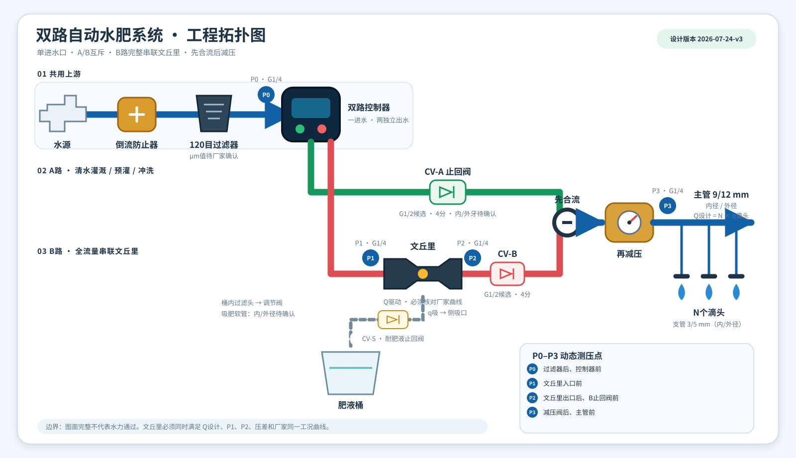
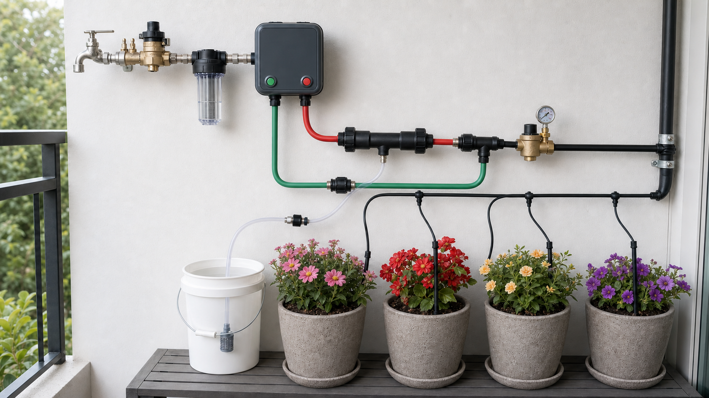

---
hide:
  - toc
---

# 双路自动水肥一体化系统

> 文档类型：入口索引  
> 最后核对日期：2026-07-24  
> 事实来源：本仓库设计约束、现场待测参数及所购设备厂家数据表

本网站记录双路智能控制器在“A/B 两个独立出水口、互斥运行”条件下的滴灌施肥设计。A 路负责清水预灌和冲洗；B 路的全部驱动水完整通过文丘里后才进入主管。

图 1：系统工程拓扑。连接关系、流向、测点和流量标记以本图为设计基准；点击图片可查看全尺寸版本。

  

    <strong>已确定设计</strong>
    A/B 互斥、B 路串联文丘里、合流前双止回、合流后减压。
  

  

    <strong>待现场实测</strong>
    水源动态压力、管长、高差、实际滴头流量、吸液量和冲洗终点。
  

  

    <strong>待厂家确认</strong>
    控制器反压能力、文丘里完整性能曲线、减压阀最小压差和材料兼容性。
  

!!! warning "先判断水力可行性"
    `A → B → A` 的控制逻辑可以成立，但不能证明文丘里在现场会吸肥。若设计流量、入口压力或允许压损不落在所购文丘里的厂家曲线上，B 路判定为“不适用”。

## 当前设计数据

--8<-- "docs/_generated/current-design-summary.md"

## 按任务阅读

| 要完成的任务 | 先读 | 再核对 |
| --- | --- | --- |
| 按图识别水路和测点 | [工程图读图与测点](architecture/diagram-walkthrough.md) | [系统原理](architecture/system-overview.md) |
| 购买部件 | [部件选型与数量计算](design/component-sizing.md) | [资料来源与厂家数据](reference/sources.md) |
| 核对牙型和转接件 | [接口、牙型与管径清单](reference/interface-schedule.md) | 接口规格事实簿 |
| 判断压力和文丘里 | [工程计算工作表](calculations/engineering-calculator.md) | 所购型号曲线与现场实测表 |
| 安装并首次通水 | [安装与清水调试](operations/installation-commissioning.md) | [故障诊断](operations/troubleshooting.md) |
| 设置自动计划 | [A → B → A 控制程序](operations/controller-program.md) | 控制器本地计划和互斥能力 |

## 图片说明

图 2：无品牌实景参考。它只用于理解固定方式和空间关系，不参与水力拓扑判定。

## 使用原则

1. 先用清水完成所有压力、反向窜流、滴头流量和文丘里吸液试验。
2. 只有清水试验通过后才加入肥料。
3. 任何缺少厂家曲线或动态压力的关键项都标记为“待确认”，不能用接口口径代替性能数据。
4. 主管冲洗时间由管内容积、实际流量和末端电导率恢复结果确定，不固定套用 5～10 分钟。
